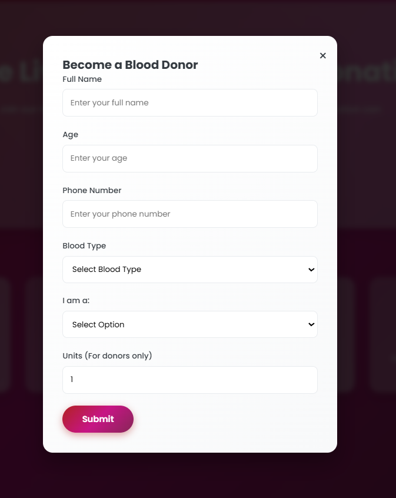
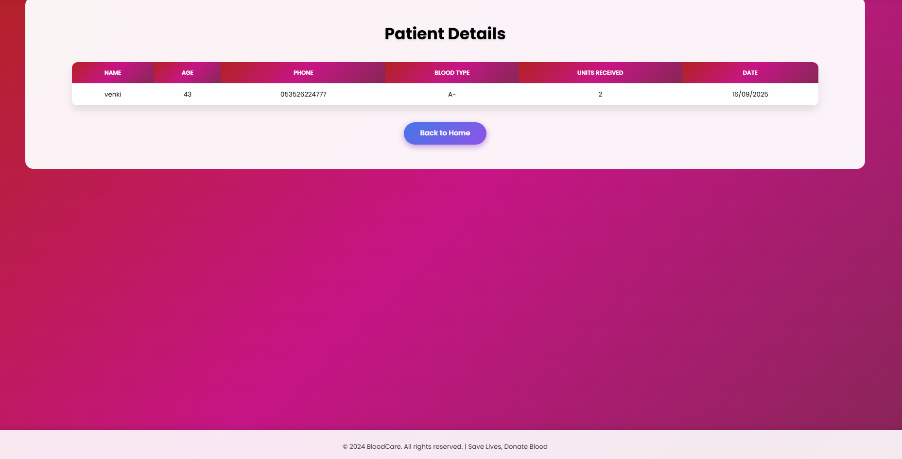
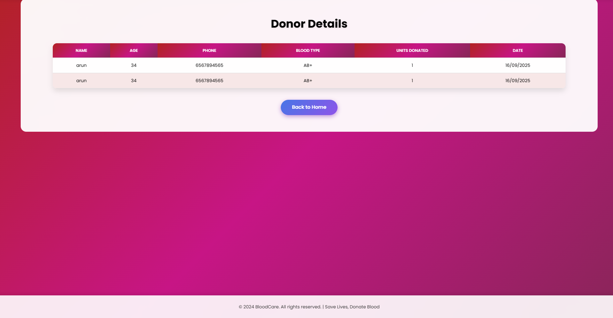
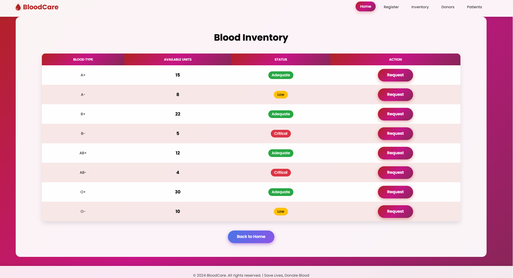

# 🩸 Blood Donation Management System

The Blood Donation Management System is a full-stack web application designed to streamline and digitalize the process of blood donation and request management. It provides a platform where donors can register and manage their profiles, while recipients can easily request and track blood availability. The system also allows administrators to manage donor data, blood requests, and oversee the overall process.
---

## 🌐 Live Demo  
🔗 [Blood Donation Management System](https://adityamahekar.github.io/Blood_Donation__Management/)

---

## 🚀 Features
- 🧍 User registration & login (with sessions)  
- 👤 Donor profile & details management  
- 🩸 Blood request submission & tracking  
- 🔍 Search donors by blood group
- 📊 Admin view for managing data  

---

## 📷 Gallery 

| Home Page | Blood Request Form |
|------------|--------------------|
|  |  |

| Patient List | Donor List |
|--------------|------------|
|  |  |

| Inventory Page |
|--------------|
|  |
---

