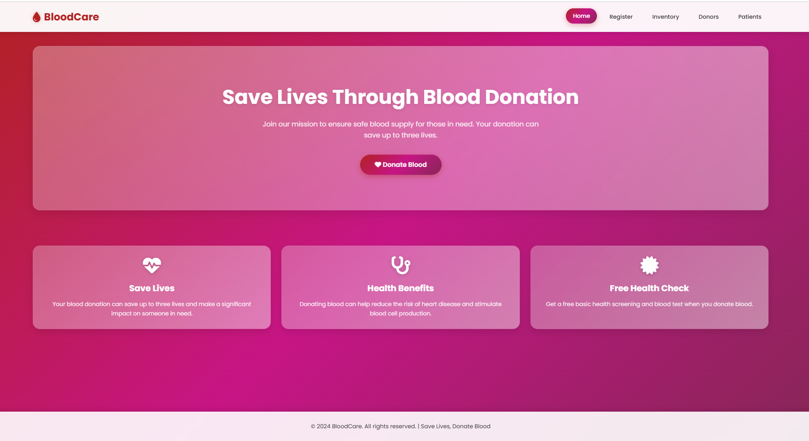

# 🩸 Blood Donation Management System

A full-stack web application to manage blood donors and requests efficiently.  
Built with **Node.js**, **Express.js**, **EJS**, and **PostgreSQL**.

---

## 🌐 Live Demo  
🔗 [Blood Donation Management System](https://adityamahekar.github.io/Blood_Donation__Management/)

---

## 🚀 Features
- 🧍 User registration & login (with sessions)  
- 👤 Donor profile & details management  
- 🩸 Blood request submission & tracking  
- 🔍 Search donors by blood group/location  
- 📊 Admin view for managing data  
- 🎨 Responsive UI with Tailwind CSS  

---

## 🛠️ Tech Stack
- **Frontend**: HTML, EJS, Tailwind CSS  
- **Backend**: Node.js, Express.js  
- **Database**: PostgreSQL  
- **Session Auth**: express-session  
- **Deployment**: Localhost / Railway / Render  

---

## 📷 Screenshots  

| Home Page | Blood Request Form |
|------------|--------------------|
|  |  |

| Patient List | Donor List |
|--------------|------------|
|  |  |

| Inventory Page |
|--------------|
|  |
---

